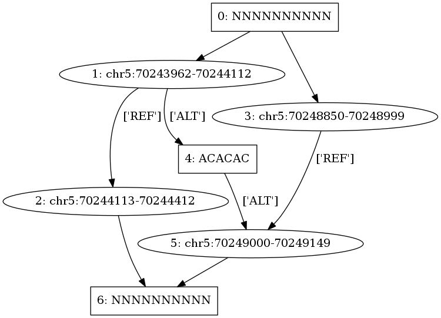
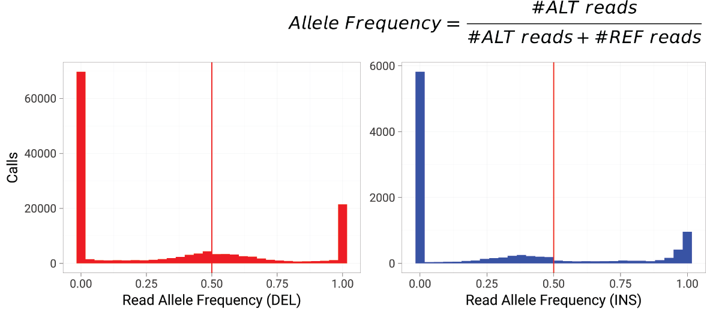

# Graph model summary

Each graph model is based on a reference sequence and alternate paths 
associated with alternative alleles or some characteristics of the region 
we would like to evaluate read support for.

Our graphs may be created specifically for a particular event type 
(deletion, insertion, swap) or from a VCF file. In this document, we describe
the main concepts behind our graph genotyping methods.

<!-- vscode-markdown-toc -->
* [Graph Models](#GraphModels)
	* [Example 1 -- Simple Swap](#Example1--SimpleSwap)
	* [Example 2 -- Short swap](#Example2--Shortswap)
	* [Example 3 -- Short deletion](#Example3--Shortdeletion)
	* [Example 4 -- Long deletion](#Example4--Longdeletion)
	* [Example 5 -- Long Swap](#Example5--LongSwap)
* [Breakpoint Genotyping](#BreakpointGenotyping)
* [Whole Variant Genotyping](#WholeVariantGenotyping)
* [Example](#Example)
	* [Breakpoints](#Breakpoints)
	* [Whole Variant](#WholeVariant)

<!-- vscode-markdown-toc-config
	numbering=false
	autoSave=true
	/vscode-markdown-toc-config -->
<!-- /vscode-markdown-toc -->


## <a name='GraphModels'></a>Graph Models

Graphs may be created from VCF or for particular events specified in 
a JSON file. For details on the VCF to graph conversion see 
[graph-tools.md#vcf2paragraph.py](graph-tools.md#vcf2paragraph.py)
and [README.md#Usingvcf2paragraph.pytorunparaGRAPH](../README.md#Usingvcf2paragraph.pytorunparaGRAPH).

Each graph we create contains the following information:

*  **Sequence labels**: Sequence labels are used to tag particular paths through our graph. 
   Each sequence label corresponds to a set of *paths* through the graph.
*  **Nodes**: Each node represents a piece of sequence that is at least one nucleotide long. 
   Nodes may be associated with one or more *sequence labels*. The sequence for each node
   may be specified explicitly, or can be retrieved from a reference FASTA file. Nodes
   may thus be associated with linear reference locations.
*  **Edges**: Edges connect nodes in a directed fashion (`from` node &rarr; `to` node). 
   Our graphs are required to be directed and acyclic, and edges may be associated with one or 
   more sequence *sequence labels*.
*  **Paths**: A path is specified by a list of node names, where we required forward edges between each 
   pair of subsequent nodes to exist (i.e. we must be able to walk along our graph along this path).
   Each path is associated with exactly one sequence label (but one sequence label may correspond
   to multiple paths). 

Graphs may be created for different event types. The following examples 
illustrate a few such events.

### <a name='Example1--SimpleSwap'></a>Example 1 -- Simple Swap

Manually created JSON file to illustrate how to name nodes. See [swap-example-1.json](swap-example-1.json).

Creating these files from VCF is better since it creates edge labels,
paths and disambiguation sequences too.


### <a name='Example2--Shortswap'></a>Example 2 -- Short swap

```bash
vcf2paragraph.py swap-example-2.vcf swap-example-2.json -r hg19.fa -p 100
paragraph2dot.py swap-example-2.json swap-example-2.dot
dot -Tsvg swap-example-2.dot > swap-example-2.svg
```

Short swap with REF and ALT branch:


### <a name='Example3--Shortdeletion'></a>Example 3 -- Short deletion

```bash
vcf2paragraph.py del-example-3.vcf del-example-3.json -r hg19.fa -p 100
paragraph2dot.py del-example-3.json del-example-3.dot
dot -Tsvg del-example-3.dot > del-example-3.svg
```

This is a short deletion with two straightforward paths: REF and ALT.


### <a name='Example4--Longdeletion'></a>Example 4 -- Long deletion

```bash
vcf2paragraph.py del-example-4.vcf del-example-3.json -r hg19.fa -p 100
paragraph2dot.py del-example-4.json del-example-3.dot
dot -Tsvg del-example-4.dot > del-example-3.svg
```

This is a longer deletion. We get two branches, one for each breakpoint.


### <a name='Example5--LongSwap'></a>Example 5 -- Long Swap

```bash
vcf2paragraph.py swap-example-5.vcf swap-example-5.json -r hg19.fa -p 100
paragraph2dot.py swap-example-5.json swap-example-5.dot
dot -Tsvg swap-example-5.dot > swap-example-5.svg
```

This is a longer swap. We get two branches, one for each breakpoint.



## <a name='BreakpointGenotyping'></a>Breakpoint Genotyping

Breakpoints in a linear reference produce branchings in our graphs. We consider 
two types of breakpoint: forward breakpoints where one node has multiple edges
going out, and reverse breakpoints where one node has multiple edges incoming 
(this excludes source and sink nodes).


Each incoming / outgoing edge corresponds to one *allele*. Breakpoint genotyping
uses read counts on these edges to determine the most likely one or two alleles
supported by the sequencing experiment.

Each breakpoint is genotyped independently. After genotyping all breakpoints
for a particular event we compare the genotypes at each breakpoint to check 
the calls are consistent. To do this, we use our sequence labels on the edges
to name each allele -- each sequence label is assumed to support one particular
allele/haplotype for each event.

Note that one node may correspond to two breakpoints if it has more than one 
input edge and more than one output edge. Genotyping of these two breakpoints
will be performed independently.

Consider a breakpoint in one sample. We define:


  
We define the likelihood of observing a set of reads 
given genotype **G<sub>a/b</sub>** as follows:


That is, the likelihood of observing reads in R under genotype a/b is the product of (A) the likelihood of reads aligned to edges corresponding to haplotypes a and b and (B) the likelihood of reads aligned to other edges (erroneously if a/b is the true genotype).

The likelihood of observing genotype **G<sub>a/b</sub>** given a set of reads **R** is then 


where &nbsp;P(G<sub>a/b</sub>)&nbsp; is the prior genotype probability for **G<sub>a/b</sub>** (e.g. a
population frequency, or uniform prior over all possible genotypes).
 
We assume that the read count for a locus is Poisson-distributed with
mean **λ**. Let **dpois(N, λ)** be the probability of observing 
**N = N<sub>≠a,b</sub> + N<sub>a</sub> + N<sub>b</sub>** reads. 

With read length ***l***, average sequencing depth ***d***, and a 
pre-defined read-anchoring overlap of ***m*** bases, we the mean 
**λ** for **R** as **λ = round( *d*  (*l* - *m*) / *l* )**. This
correction is used because we require the reads we use as support
for breakpoint edges to not just overlap a single nucleotide, but 
rather ***m*** bases which anchor the read on either side of the
breakpoint.

Let **ε<sub>a/b</sub>** be the read error rate which models the 
fraction of reads which may have been identified to support an 
incorrect haplotype (i.e. a non- *a*/*b* haplotype in case
of ***G<sub>a/b</sub>*** ). The likelihood for reads not mapped
to *a* or *b* is:


To compute the read likelihood for reads supporting haplotypes
*a* and *b*, we consider two cases.

If *a*, *b* are the same haplotype, we have **N<sub>a,b</sub> = N<sub>a</sub> + N<sub>b</sub>**, and we use


For the case where *a*,*b* are different haplotypes, we introduce two more 
parameters *μ<sub>a</sub>*, *μ<sub>b</sub>* which denote the expected fraction
of reads supporting haplotypes *a* and *b* respectively:


The additional parameters are useful 
because we are differently successful retrieving the reads supporting each 
allele depending on its type. In the ideal case, values for μ should be 
close to 0.5. However, when genotyping insertions we may be missing some of
the reads for our insertion allele since they may not have been aligned 
within the target regions. This can be accounted for by using a lower 
μ value. Empirically, we can use the mean read allele frequency for each 
allele type as an approximation:



In the current version of this tool we apply the same model and parameter
set to all events. However, it is possible to improve the accuracy of 
genotyping by using an Expectation-Maximisation algorithm to estimate
error parameters for individual events as long as these have a high-enough
population allele frequency.

## <a name='WholeVariantGenotyping'></a>Whole Variant Genotyping
We use the above breakpoint genotyping model to determine the most likely 
genotype for each breakpoint.

To report a final genotype for the variant, we follow these conventions: 

* If all breakpoints have the same most likely genotype, report this genotype as the overall variant genotype. The resulting filter value is *PASS*
* If some breakpoints have homozygous reference genotype, and the other breakpoints have 
another consistent non-reference genotype, report this non-reference genotype and label
the filter as *CONFLICTS*.
* If none of the above, the genotype is reported as *MISSING* (**./.**) and the filter is set to *CONFLICTS*.

## <a name='Example'></a>Example

A graph model for a sequence swap consists of four nodes representing left flank, deleted sequence, inserted sequence, and right flank. It can be represented schematically like this:


This graph has two breakpoints: breakpoint #1 defined by two "from" edges and breakpoint #2 defined by two "to" edges (see the diagram above).

### <a name='Breakpoints'></a>Breakpoints

Here we calculate **G<sub>REF/INS</sub>**, the likelihood of *REF/INS* genotype of breakpoint #1.
We have haplotype *a*, *b* representing edge *LF_REF* and *LF_INS*, respectively.

We set **N<sub>a</sub>** to the number of reads overlapping left flank / reference edge (*LF_REF*), and **N<sub>b</sub>** to the number of reads mapped to left flank / insertion edge (*LF_INS*). Assume:

&nbsp;&nbsp;&nbsp;&nbsp;**N<sub>a</sub> = 19**

&nbsp;&nbsp;&nbsp;&nbsp;**N<sub>b</sub> = 1**

Since there are no other edges, the number of reads mapped to neither edges is zero, which means

&nbsp;&nbsp;&nbsp;&nbsp;**N<sub>≠a,b</sub> = 0**

Assume the sample has depth ***d*** = 20, read length ***l*** = 100. Using the default parameter of minimum base overlap

&nbsp;&nbsp;&nbsp;&nbsp;***m* = 4**

&nbsp;&nbsp;&nbsp;&nbsp;**λ = round( d * (*l* - *m*) / *l* ) = 19**

Using the default ε as 0.05:

&nbsp;&nbsp;&nbsp;&nbsp;**λ<sub>≠a,b</sub> = round(λ * ε) = 1**

&nbsp;&nbsp;&nbsp;&nbsp;**P(R<sub>≠a,b</sub> | G<sub>a/b</sub>) = dpois(N<sub>≠a,b</sub>, λ<sub>≠a,b</sub>) = dpois(0, 1) = 0.368**.

Using haplotype fraction **μ** = 0.5 for both **μ<sub>a</sub>** and **μ<sub>b</sub>** we get

&nbsp;&nbsp;&nbsp;&nbsp;**λ<sub>a</sub> = λ<sub>b</sub> = round(λ * (1 - ε) * μ) = 10**

&nbsp;&nbsp;&nbsp;&nbsp;**P(R<sub>a,b</sub> | G<sub>a/b</sub>) = dpois(N<sub>a</sub>, λ<sub>a</sub>) * dpois(N<sub>b</sub>, λ<sub>b</sub>)**

&nbsp;&nbsp;&nbsp;&nbsp;&nbsp;&nbsp;&nbsp;&nbsp;&nbsp;&nbsp;&nbsp;&nbsp;&nbsp;&nbsp;&nbsp;&nbsp;&nbsp;&nbsp;&nbsp;&nbsp;&nbsp;&nbsp;&nbsp;&nbsp;&nbsp;&nbsp;&nbsp;&nbsp;&nbsp;&nbsp;&nbsp;&nbsp;**= dpois(19, 10) * dpois(1, 10)**

&nbsp;&nbsp;&nbsp;&nbsp;&nbsp;&nbsp;&nbsp;&nbsp;&nbsp;&nbsp;&nbsp;&nbsp;&nbsp;&nbsp;&nbsp;&nbsp;&nbsp;&nbsp;&nbsp;&nbsp;&nbsp;&nbsp;&nbsp;&nbsp;&nbsp;&nbsp;&nbsp;&nbsp;&nbsp;&nbsp;&nbsp;&nbsp;**= 3.73e<sup>-3</sup> * 4.54e<sup>-4</sup> = 1.69e<sup>-6<sup>**

Using a uniform genotype prior for three genotypes (REF/REF, REF/INS and INS/INS) we
get

&nbsp;&nbsp;&nbsp;&nbsp;**P(G<sub>a/b</sub>) = 1/3 ≈ 0.33**

The resulting likelihood of genotype REF/INS is:

&nbsp;&nbsp;&nbsp;&nbsp;**P(R | G<sub>a/b</sub>) = 0.33 * 0.368 * 1.69e<sup>-6</sup> = 2.08e<sup>-7</sup>**

Similarly, we can get the likelihood of genotype REF/REF as **1.08e<sup>-2</sup>**, and INS/INS as **4.11e<sup>-26</sup>**.

Therefore, the maximum likelihood genotype of this breakpoint is REF/REF.

### <a name='WholeVariant'></a>Whole Variant

As we have calculated above, genotype of BP1 is REF/REF. 
If BP2 is also genotyped as REF/REF, then the variant genotype will be REF/REF. 
The filter flag will be set as *PASS*.

If BP2 is not REF/REF and BP1 is the reference genotype, then the variant genotype will be the genotype of BP2. However, the filter flag will be set as *CONFLICTS* to indicate that not all breakpoints
support this genotype. This may happen when for example when we type an event where the 
start of the of the event is correct but the end is not.
